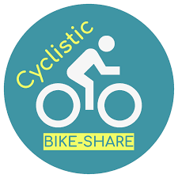
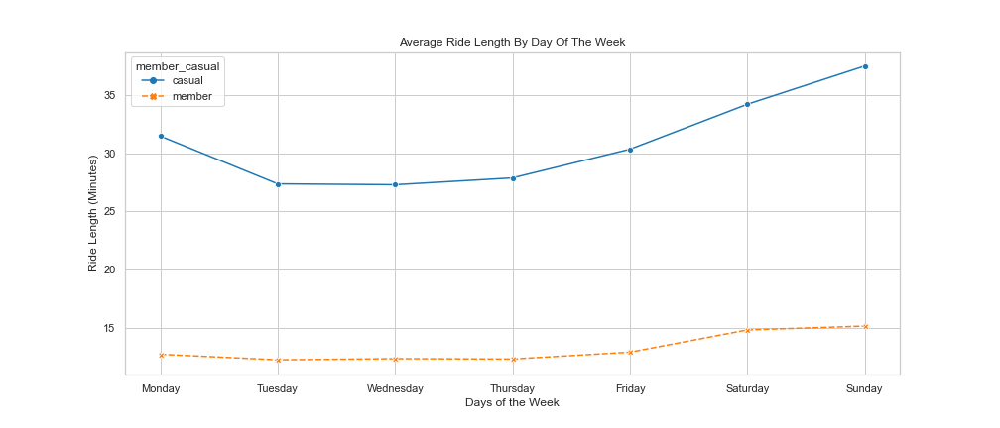

# CYCLISTIC BIKE SHARE CASE STUDY

<i>How does a bike-share navigate speedy success?</i>

### ABOUT THE COMPANY

Founded in 2016, Cyclistic is a bike-share program that features more than 5,800 bicycles and 600 docking stations. In addition to offering traditional bikes, the company also has reclining bikes, hand tricycles, and cargo bikes included in its renting options. They can be unlocked from one station and returned to any other station in the system anytime.

Cyclistic has flexible pricing plans: single-ride passes, full-day passes, and annual memberships. Customers who purchase single-ride or full-day passes are referred to as casual riders while customers who purchase annual memberships are known as members.

The company's finance analysts have concluded that annual members are much more profitable than casual riders. Although the pricing flexibility helps the company attract more customers, Lily Moreno – Cyclistic's marketing director – believes that maximizing the number of annual members will be key to future growth. Instead of creating a marketing campaign that targets all-new customers, Moreno believes there is a very good chance to convert casual riders into members.

### BUSINESS TASK

<li>Analyzing the company’s historical bike trip data to identify trends into how annual members and casual riders use Cyclistic bikes differently.</li>

### STAKEHOLDERS

<li><b>Lily Moreno</b> – Cyclistic’s marketing director.</li>

<li><b>Cyclistic marketing analytics team</b> – A team of data analysts who are responsible for collecting, analyzing, and reporting data that helps guide the company’s marketing strategy.</li>

<li><b>Cyclistic executive team</b> – Responsible for deciding whether to approve the recommended marketing program.</li>

## 1. ASK

<li>How do annual members and casual riders use Cyclistic bikes differently?</li>

## 2. PREPARE

The data used in this project has been made available by Motivate International Inc. under this <a href="https://ride.divvybikes.com/data-license-agreement" title=”license”>license</a>.The datasets are named differently because Cyclistic is a fictional company. Divvy, the name you will see on the files, is a real bike-share system in Chicago with over 600 stations and 6,000+ bikes across the city. For this reason, the data is quite appropriate and will help us explore how different customer types are using Cyclistic's bikes.

It is important to note, however, that data-privacy issues prohibit us to have access to the users' personal information, meaning we will not be able to connect pass purchases to credit card numbers in order to determine if casual riders live in the Cyclistic service area, or if they have purchased multiple single passes. You can check the datasets <a href="https://divvy-tripdata.s3.amazonaws.com/index.html" title=”here”>here</a>.

We will be working with 12 CSV files, comprehending the datasets between ‘202104-divvy-tripdata’ and ‘202203-divvy-tripdata’. This data corresponds to the period between April 2021 and Mar 2022. On those files, we will find the types of bikes available for rental, the date and time of each bike rental and its return to the station, the different station names, and more. Considering our data limitations, we will not be able to find out whether a casual rider spends more money per year than they would on an annual membership, their gender, age, or neighborhood - but we can still use this dataset to explore trends and learn how casual riders and members differ in their bike rental habits.

## 3. PROCESS

#### Data Exploration

<li>Overview of the data</li>

<li>Combining all of the datasets into one with concat()</li>

<li>Taking a closer look at the dataset</li>

<ul>
<li>How many unique rides are there in total?</li>
<li>How many types of bikes are there?</li>
<li>How many rows and columns are there in the dataframe?</li>
</ul>

#### Cleaning The Dataset

<li>Checking for empty cells</li>

<li>Dropping unnecessary columns as they’re missing data and not being representative of the population</li>

<li>Looking for duplicates</li>

## 4. ANALYZE

#### Data Transformation

<li>Changing data formattings</li>

<li>Creating an hour column</li>

<li>Creating a day of the week column</li>

<li>Creating a month column</li>

<li>Creating a ride length column</li>

<li>Removing Outliers</li>

#### Trip EDA

Take a close look at more specific information surrounding the dataframe. Since the business task is to find out how casual riders and members are using Cyclistic bikes differently, going to filter the data and create some pivot tables to compare the numbers from the two types of columns.

<li>Rides by customer type</li>

<li>Average ride length</li>

<li>The most popular rideable type</li>

<li>The most popular day of the week for bike rentals</li>

<li>The most popular month for bike rentals</li>

<li>The average ride length by the day of the week</li>

<li>The average ride length by month</li>

<li>Total number of rides per hour</li>

## 5. SHARE

#### Visualizing rides by user type

The above pie chart shows us that <b>annual members represent the majority of Cyclistic-Bike Sharing system users</b>, making up to <b>55%</b> of total users.

#### Visualizing average ride length by user type

The bar char above shows that <b>casual riders have much greater ride length on average than members.</b> The average ride length is <b>32 mins for casual riders</b> and <b>13 mins for members</b>.

#### Visualizing the most popular rideable type

According to the dataset, Cyclistic's Bikes are divided into three groups : <i> classic bike, docked bike,</i> and <i>electric bike</i>. It is clear from the visaulization above that <b>classic bike is most rented rideable type by both casual riders and members</b>. This could either be explained by the users showing a preference for the classic bike or, more, plausibly, the company has invested more heavily in a classic bike based system than the other two options.

#### Visualizing the most popular day of the week for bike rentals

When it comes to bike rentals by day of the week, there are differences between casual riders and members. For instance, <b>Saturday is most popular day for casual riders</b>, and <b>Wednesday is most popular day for members</b>. The two groups differ considerably when it comes to bike rentals throughout the weekdays : <b>members consistently rent bikes on daily basis while casual riders present lower weekday numbers compared to the weekend</b>.

#### Visualizing the most popular month of the year for bike rentals

Visualizing the number of rides can be helpful to recognize if seasonality plays a role in bike rental. The bar chart above shows us that <b>the number of rentals increases during summer months</b> and gradually drops over the fall and winter for both user types. The main difference is that members are still more consistent with their rental habits throughout the year when compared to casual riders, whose numbers drop significantly during the winter months.

#### Visualizing average ride length by day of the week 

On this plot, it becomes clear that <b>ride length increases on the weekends</b> for both the groups. The difference between casual riders and members in this scenario lies in the duration of rides. <b>Casual riders tend to take longer rides, longest one being of 37 mins</b>. In contrast, <b>members present much shorter rides that last max of 15 mins</b>.

 Considering the lack of personal user data for privacy reasons, it is difficult to determine exactly what causes casual riders and members to have such different riding lengths. It is likely that members live close to work/school and choose to commute using Cyclistic's Bike Sharing System. As for the casual riders, taking into consideration that they purchase either single-ride or full-day passes, this makes them less likely to use the service on daily basis as members do. Casual riders could have longer ride lengths because they're using it for leisure or tourism. Regardless, it is difficult to answer this question with certainity why ride length increases on the weekends for both groups given the gaps in the data.

#### Visualizing average ride length by month of the year

Visualizing ride length by month of the year can help in recognizing user's riding habots throughout the year. Note that the ride length changes considerably for casual riders as the months go by. For this type of customer, <b>the ride length peaks during summer, reaching an average of 38 mins in April</b> - before dropping in May. <b>As for the members, the ride length does not change drastically over the months, peaking in April - averaging 14 mins</b> and then gradually dropping after June for the remainder of the year.

Considering the short trips, this could indicate that members use Cyclistic's bikes to commute, and perhaps, run errands. The drop in ride length over the winter months could indicate that members choose other means of transportation to commute during that time of the year. In contrast, casual riders could be using it for leisure or tourism - as mentioned earlier - especially during the spring and summer.

#### Visualizing the total number of rides per hour

By taking a closer look into the total num of rides per hour can help in finding more patterns in the customer's bike rental habits. The <b>num of bike rentals by casual riders begins to increase between 8:00 a.m. and 10:00 a.m., peaking at 5 p.m. As for the members, the numbers start to go up earlier - between 6 a.m. and 7 a.m. also peaking at 5:00 p.m.</b> Notice that the num of rides by members is far greater than casual riders. This could be related to the fact that members represent the majority of users and likely use Cyclistic's services for their daily commute.

## 6. ACT

### Key Findings

<li>Annual members are the majority of users, making up for 55% of Cyclistic's customer.</li>

<li>Casual riders have an average of 32 mins while members take shorter trips, averaging 13 mins.</li>

<li>Classic bike is the most popular rideable type for both the groups, followed by electric and docked bike, respectively.</li>

<li>Saturday is the most popular day of the week for bike rentals for casual riders. In contrast, Wednesday is most popular day of the week for bike rentals for the members.</li>

<li>Members consistently rent bikes on daily basis while casual riders present lower weekday numbers compared to the weekend.</li>

<li>July is the most popular month of the year for bike rental, hence, there is clear rise in numbers during the summer for both casual riders and members.</li>

<li>Both user types take longer rides during spring and summer months.</li>

<li>The num of bike rentals by casual riders begins to increase between 8:00 a.m. and 10:00 a.m., peaking at 5 p.m. As for the members, the numbers start to go up earlier - between 6 a.m. and 7 a.m. also peaking at 5:00 p.m.</li>

<li>Average ride length combined with the average time of the day rentals indicates that members use Cyclistic's bikes to go to work/school. The noticeable drop in ride length over the winter could be related to a change in means of transportation to commute during that time of the year.</li>

<li>Casual riders' bike rental numbers on the weekends paired with average ride length during the summer suggest that they are using the single-ride and full-day passes for leisure or tourism.</li>

#### After conducting analysis with support of visualization, it becomes clear how casual riders and members use Cyclistic's bikes differently 

<li><b>Casual Rider</b> tend to rent more bikes on the weekends - especially over the summer. Considering long average ride lengths, this combination of factors suggest that this group of customers use the bikes for leisure.</li>

<li><b>Members</b> tend to use Cyclistic's bike sharing system on a daily basis for shorter rides, indicating its use for commuting to work/school and running errands on the weekends.</li>

### Recommendations 
> 
<li>Increase marketing campaign targeted at casual riders through emails, text messages, and app notifications during summer months, when bike rental is more frequent. The ads could offer special discounts for the annual membership in order to encourage casual riders to make the switch.</li>

> 
<li>Create reward points for members, where each bike rental adds up a certain number of points to the user’s account. The points could get higher with rental frequency and trip duration, and at the end of each year, the user could exchange the points for a discount on membership renewal.</li>

> 
<li>Cyclistic could study partnering up with local companies and offer special deals on places such as fitness centers, movie theaters, beauty salons, and restaurants. Focusing on entertainment and wellness segments could motivate casual riders into signing up for the annual membership.</li>

> 
<li>Since casual riders do not rent bikes as much as members during the weekdays, Cyclistic’s marketing team should also consider the possibility of creating two new types of membership :</li>

> 
<ul><li>An annual membership that only includes the weekends. This way, the customers that only rent bikes twice a week could pay accordingly and still add to the company’s growing number of members.</li>
<li>A seasonal membership tailored for the group of people that likes to ride bikes during the summer, but do not have any interest in renting it for the remainder of the year. This type of membership could be billed annually, and offer a special discount in comparison to the single-ride and full-day passes.</li></ul>

#### Additional Considerations & Future Improvements

Given the fact that there were certain gaps in discovered in the data, such as the lack of payment, age, gender, and geographical information, it is difficult to make further recommendations. Demographic data plays a significant role in creating a successful marketing campaign because it allows businesses to understand their audience better. Once the company has this information, they can segment their customers into separate groups based on their habits, interests, and other important characteristics. This way, the marketing team is able to create customized ad campaigns capable of achieving Cyclistic’s marketing and financial goals.

